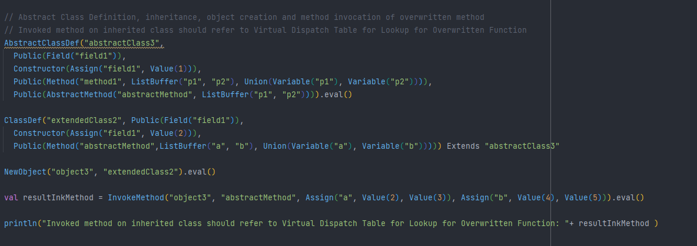
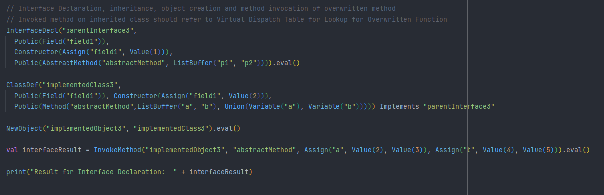
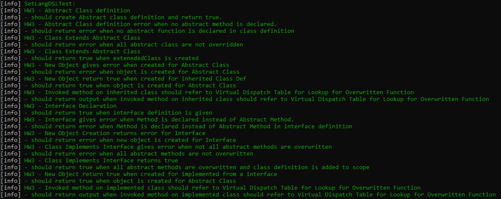

# CS - 474 | Homework 4 | Due: 04/11/2022
### Description: using a language for users of the set theory that you created in the previous homeworks add constructs for control structures and exception handling using lazy evaluation and call-by-name.

## Name: Samihan Nandedkar
### UIN: 667142409
### Email: snande3@uic.edu

<hr/>

### Running the Project
The project and be compiled and run two ways.
* Through Command Line
    * Clone the following repository in your system.
    * On command line please navigate to the following repository. And run the following commands to compile and run the code.
  ```
  sbt clean compile test
    ``` 
    ```
    sbt clean compile run
    ```
* Through IntelliJ IDEA
    * Clone the following repository in your system.
    * Import the project into IntelliJ.
    * Compile and run the simulation from there. 

### Project Description

The main aim of the project is to create a Domain Specific Language using Scala to perform the various set operations.


### Project Structure
* All the language descriptions are present in `SetLangDSL` file present in com.samihan.hw1 package.
* The test cases for the project are present in /src/test/scala/SetLangDSLTest.scala files. 
* Practice.scala can be used to implement and test the language syntax.

### How to use SetLangDSL Language.
* Please import the following package to use the language.
```
import com.samihann.hw1.SetLangDSL.SetDeclarations.*
```
* A sample [file](/src/main/scala/Practice.scala) is created to practice and test the language's syntax.
* In addition, sample code is provided in the `Practice` module for all the functionalities of the language.
* All the operations need to be executed with operation.eval to perform the computation and receive output.
* Detailed explation of the language syntax and semantics is provided below. 

<hr/>

### Implementation: Reasoning, Implementation and Logic

From this homework we wanted to address following questions and build logic to satisfy the reasoning. 

#### Questions & Implementation Done

1. Can a class/interface inherit from itself?

  * A class/interface cannot inherit from itself. As such a inheritance server no purpose as the same attributes will be replicated.
  * In this implementation the Extends/Implements performs check as the beginning of the function to restrict the self inheritance.

2. Can an interface inherit from an abstract class with all pure methods?

* Interface can only inherit from other interfaces as interfaces only provides signatures not implementations. If the interface inheriting a class inherited its implementation, it would provide implementation and no longer be an interface.
* In this implementation, the inheritance is restricted in Implements where if the child component's type is interface then the parent should be of type interface as well. 

3. Can an interface implement another interface?

* Interface only provides signatures not implementations. So an interface cannot implement another interface.
* In this implementation, the Interface only accepts AbstractMethods in its definition. So, the user will not be able to pass a Method to Interface which is able to perform implementation.

4. Can a class implement two or more different interfaces that declare methods with exactly the same signatures?

* A class is able to implement multiple interfaces that have methods with same signatures. If the class definition can override the multiple methods.
* In this implementation the overwritten methods for an inheritance are kept track using Virtual Dispatch Table, which is a map pointing to the correct method to invoke whenever called.

5. Can an abstract class implement interfaces?

* An abstract class is able to implement interfaces. 
* In this implementation the abstract class can have method definitions. As the abstract class can contain method definition, it can be overwritten during the declaration.

6. Can a class implement two or more interfaces that have methods whose signatures differ only in return types?

* A class is not able to implement two of more interface that have methods whose signatures differ only in return types. 
* In this implementation, multiple inheritance is restricted. To keep track a "inheritance" parameter declared in the classBindingScopeMap.

7. Can an abstract class inherit from a concrete class?

* An abstract class can inherit from a concrete class. 
* In this implementation, an abstract can be inherited from a concrete class as all the Public & Protected attributes and methods are added to abstract class definition in Extends function.

8. Can an abstract class/interface be instantiated as anonymous concrete classes?

* An abstract class or interface by definition cannot be instantiated. 
* In this implementation, NewObject performs the check which restricts the Interface and AbstractClass to create a object.  


#### Logic Used

1. AbstractClassDef:

* Abstract class definition can accept name, fields, constructor, methods & abstract methods as parameter to the function. 
* It will create a map with "name", "methods", "fields", "abstractMethods", "abstractDef" keys.
* It will assign create respective maps for each of the attributes and methods and assign to the keys in the map. 
* It will assign "abstractDef" key true value which will be used over the implementation to signify the class as abstract.
* It will perform the check to see that at least one of the operations passed is AbstractMethod. Else it will return an error.
* It will add the map to classBindingScope.

2. AbstractMethod:

* Abstract Methods can accept name, params as the input parameter to function. 
* It will not have body, hence no operation is accepted.

3. Interface:

* Interface definition can accept name, fields, constructor & abstract methods as parameter to the function.
* It will create a map with "name", "fields", "abstractMethods" keys.
* It will assign create respective maps for each of the attributes and methods and assign to the keys in the map.
* It will add the map to interfaceBindingScope.

4. Inheritance:

* Extends & Implements are the function used to inherit a Class & Interface respectively. 
* It will perform the check to see if all the abstract method in parent class/interface is implemented. 
* It will add the overwritten methods to VirtualDispatchTable to keep track of the methods to invoke. 
* It will copy the public and protected methods and attributes to the child class. 

5. Virtual Dispatch Table:

* Virtual Dispatch Table will keep track of the overwritten methods in Extends and Implements.
* This mapping will be used by InvokeMethod to evaluate the correct Method whenever called.

6. NewObject:

* NewObject perform the additional check to restrict Interface & Object from creating objects.

<hr/>

### SetLandDSL: AbstractClass, Interface, Abstract Methods & Inheritance syntax

Quick glance of list of commands to create abstract class & methods, interface and to inherit from Abstract Class and Interface Declaration.

<table>
<thead>
<tr>
<td>
<b>Syntax</b>
</td>
<td>
<b>Parameters</b>
</td>
<td>
<b>Usage</b>
</td>
</tr>
</thead>
<tbody>


<tr>
<td>
AbstractClass(name, operations*)
</td>
<td>
1. name <br/>
Type: String <br/>
2. operations <br/>
Multiple Parameters
Type: SetDeclarations (Fields, Constructor, Methods & AbstractMethods) <br/>

Note: Each AbstractClass definition will declaration of atleast one Abstract Method or a error will be returned.
</td>
<td>
AbstractClassDef("Hello", Private(Field("helloAgain")), Constructor(Assign("helloAgain", Value(2))), Protected(AbstractMethod("m2", ListBuffer("a", "b"))) ,Public(Method("m2", ListBuffer("a", "b"), Union(Variable("a"), Variable("b"))))).eval()<br/>
</td>
</tr>

<tr>
<td>
AbstractMethod(methodName, parameters, operations*)
</td>
<td>
1. methodName <br/>
Type: String <br/>
2. parameters <br/>
Type: List[String] <br/>

Note: Abstract method will not have any operations.
</td>
<td>
Should be given while Abstract class/ Interface creation.<br/>
Should always be inside an access definition. <br/>
AbstractMethod("m1", ListBuffer("a","b"))<br/>
Public(AbstractMethod("m1", ListBuffer("a","b"))<br/>
</td>
</tr>

<tr>
<td>
Interface(name, operations*)
</td>
<td>
1. name <br/>
Type: String <br/>
2. operations <br/>
Multiple Parameters
Type: SetDeclarations (Fields, Constructor & AbstractMethods) <br/>

Note: Interface definition will require all methods to be of type AbstractMethod.

</td>
<td>
Interface("Hello", Private(Field("helloAgain")), Constructor(Assign("helloAgain", Value(2))), Protected(AbstractMethod("m2", ListBuffer("a", "b"))) ,Public(Method("m2", ListBuffer("a", "b")).eval()<br/>
</td>
</tr>

<tr>
<td>
Inheritance (Interface)
</td>
<td>
1. parentInterface <br/>
Type: String <br/>
2. classDef <br/>
Type: SetDeclaration.ClassDef <br/>
</td>
<td>
ClassDef("childClass",...) Implements "parentInterface"<br/>

Note: Interface inheritance requires ClassDef to override all the abstract methods declared in Interface. Else it will give error. 
</td>
</tr>

<tr>
<td>
Inheritance (AbstractClass)
</td>
<td>
1. parentClass <br/>
Type: String <br/>
2. classDef <br/>
Type: SetDeclaration.ClassDef <br/>
</td>
<td>
ClassDef("childClass",...) Implements "parentClass"<br/>

Note: AbstractClass inheritance requires ClassDef to override all the abstract methods declared in Interface. Else it will give error.
</td>
</tr>


</tbody>
</table>

### Sample Code. (Code can be found in this /src/main/scala/Practice.scala)

* Abstract Class



* Interface




### SetLangDSL: Class, Object, Inheritance Syntax

Quick glance of list of commands to create class, object, fields, methods & inheritance. 

<table>
<thead>
<tr>
<td>
<b>Syntax</b>
</td>
<td>
<b>Parameters</b>
</td>
<td>
<b>Usage</b>
</td>
</tr>
</thead>
<tbody>
<tr>
<td>
Field(name)
</td>
<td>
1. name <br/>
Type: String
</td>
<td>
Should be given while class creation using ClassDef. <br/>
Should always be inside a access definition. <br/>
Field("sampleName")<br/>
Private(Field("sampleName"))<br/>
</td>
</tr>
<tr>
<td>
Constructor(operations*)
</td>
<td>
1. operations <br/>
Type: SetDeclarations <br/>
Multiple Parameters can be passed
</td>
<td>
Should be given while class creation. <br/>
Constructor(Assign("a1", Value(2))
</td>
</tr>

<tr>
<td>
Methods(methodName, parameters, operations*)
</td>
<td>
1. methodName <br/>
Type: String <br/>
1. parameters <br/>
Type: List[String] <br/>
1. operations <br/>
Type: SetDeclarations <br/>
Multiple Parameters can be passed <br/>
</td>
<td>
Should be given while class creation.<br/>
Should always be inside a access definition. <br/>
Method("m1", ListBuffer("a","b"), Union(Variable("a"), Variable("b"))<br/>
Public(Method("m1", ListBuffer("a","b"), Union(Variable("a"), Variable("b")))<br/>
</td>
</tr>

<tr>
<td>
ClassDef(name, operations*)
</td>
<td>
1. name <br/>
Type: String <br/>
2. operations <br/>
Multiple Parameters
Type: SetDeclarations (Fields, Constructor & Methods) <br/>
</td>
<td>
ClassDef("Hello", Private(Field("helloAgain")), Constructor(Assign("helloAgain", Value(2))), Public(Method("m2", ListBuffer("a", "b"), Union(Variable("a"), Variable("b"))))).eval()<br/>
</td>
</tr>


<tr>
<td>
Private(operation)
</td>
<td>
1. operation <br/>
Type: SetDeclarations.Fields/Methods <br/>

</td>
<td>
Should be given in Class Definition<br/>
Private(Field("a").eval()<br/>
</td>
</tr>


<tr>
<td>
Public(operation)
</td>
<td>
1. operation <br/>
Type: SetDeclarations.Fields/Methods <br/>

</td>
<td>
Should be given in Class Definition<br/>
Public(Field("a").eval()<br/>
</td>
</tr>

<tr>
<td>
Protected(operation)
</td>
<td>
1. operation <br/>
Type: SetDeclarations.Fields/Methods <br/>

</td>
<td>
Should be given in Class Definition<br/>
Protected(Field("a").eval()<br/>
</td>
</tr>

<tr>
<td>
RetrieveField(objName, fieldName)
</td>
<td>
1. objName <br/>
Type: String <br/>
2. fieldName <br/>
Type: String <br/>
</td>
<td>
RetrieveField("obj1","a").eval()<br/>
</td>
</tr>

<tr>
<td>
NewObject(name, className)
</td>
<td>
1. name <br/>
Type: String <br/>
2. className <br/>
Type: String <br/>
</td>
<td>
NewObject("firstObj", "Class1").eval()<br/>
</td>
</tr>

<tr>
<td>
InvokeMethod(objName, methodName, parameters*)
</td>
<td>
1. objName <br/>
Type: String <br/>
2. methodName <br/>
Type: String <br/>
3. parameters <br/>
Type: SetDeclaration.Assign <br/>
</td>
<td>
InvokeMethod("object1", "m2", Assign("a", Value(2), Value(3)), Assign("b", Value(4), Value(5))).eval()<br/>
</td>
</tr>


<tr>
<td>
Inheritance
</td>
<td>
1. parentClass <br/>
Type: String <br/>
2. classDef <br/>
Type: SetDeclaration.ClassDef <br/>
</td>
<td>
ClassDef("childClass",...) Extends "ParentCLass"<br/>
</td>
</tr>


</tbody>

</table>


### SetLangDSL: Basic Command Syntax 

Quick glance of list of basic command to perform computation functionalities provided by the language. 

<table>
<thead>
<tr>
<td>
<b>Syntax</b>
</td>
<td>
<b>Parameters</b>
</td>
<td>
<b>Usage</b>
</td>
</tr>
</thead>
<tbody>
<tr>
<td>
Value(someValue)
</td>
<td>
1. someValue <br/>
Type: Any
</td>
<td>
Value(5).eval() -> 5 <br/>
Value("Hello").eval() -> "Hello"
</td>
</tr>
<tr>
<td>
Assign(name, values*)
</td>
<td>
1. name <br/>
Type: String<br/>
2. values <br/>
Type: SetDeclarations <br/>
Multiple Values Parameters,
Can be used to create String.
</td>
<td>
Assign("var1", Value(2)).eval()<br/>
Create a binding of (var1 -> 2), Returns 2. <br/>

Assign("varSet1", Value(2), Value(3)).eval() <br/>
Creates a set of values. (varSet1 -> (2,3) <br/>

Assign("varSet2", Value(10), Value(20)).eval() <br/>
Creates a set of values. (varSet1 -> (2,3)
</td>
</tr>

<tr>
<td>
Variable(varName)
</td>
<td>
1. varName <br/>
Type: String
</td>
<td>
Variable("var1").eval() -> 2<br/>
Variable("varSet1").eval() -> (2,3) <br/>
</td>
</tr>


<tr>
<td>
Insert(var, value)
</td>
<td>
1. var <br/>
Type: SetDeclarations <br/>
2. value <br/>
Type: SetDeclarations <br/>
</td>
<td>
Insert("varSet1", Value(5).eval() -> (2,3,5)<br/>
</td>
</tr>

<tr>
<td>
Delete(var, value)
</td>
<td>
1. var <br/>
Type: SetDeclarations <br/>
2. value <br/>
Type: SetDeclarations <br/>
</td>
<td>
Insert("varSet1", Value(2)).eval() -> (3,5)<br/>
</td>
</tr>

<tr>
<td>
Union(setVariable1, setVariable2)
</td>
<td>
1. setVariable1 <br/>
Type: SetDeclarations.Variable <br/>
2. setVariable2 <br/>
Type: SetDeclarations.Variable <br/>
</td>
<td>
Union(Variable("varSet1")", Variable("varSet2")).eval() -> (2,3,10,20)<br/>
</td>
</tr>


<tr>
<td>
Difference(setVariable1, setVariable2)
</td>
<td>
1. setVariable1 <br/>
Type: SetDeclarations.Variable <br/>
2. setVariable2 <br/>
Type: SetDeclarations.Variable <br/>
</td>
<td>
Difference(Variable("varSet1")", Variable("varSet2")).eval() -> (2,3)<br/>
</td>
</tr>

<tr>
<td>
SymmetricDifference(setVariable1, setVariable2)
</td>
<td>
1. setVariable1 <br/>
Type: SetDeclarations.Variable <br/>
2. setVariable2 <br/>
Type: SetDeclarations.Variable <br/>
</td>
<td>
SymmetricDifference(Variable("varSet1")", Variable("varSet2")).eval() -> (2,3)<br/>
</td>
</tr>

<tr>
<td>
Intersection(setVariable1, setVariable2)
</td>
<td>
1. setVariable1 <br/>
Type: SetDeclarations.Variable <br/>
2. setVariable2 <br/>
Type: SetDeclarations.Variable <br/>
</td>
<td>
Intersection(Variable("varSet1")", Variable("varSet2")).eval() -> (2)<br/>
</td>
</tr>

<tr>
<td>
CartesianProduct(setVariable1, setVariable2)
</td>
<td>
1. setVariable1 <br/>
Type: SetDeclarations.Variable <br/>
2. setVariable2 <br/>
Type: SetDeclarations.Variable <br/>
</td>
<td>
CartesianProduct(Variable("varSet1")", Variable("varSet2")).eval() -> ((3,10), (2,10))<br/>
</td>
</tr>

<tr>
<td>
Macro(nameMacro, operation)
</td>
<td>
1. nameMacro <br/>
Type: String <br/>
2. operation <br/>
Type: SetDeclarations <br/>
</td>
<td>
Macro("nameMacro", Intersection(Variable("varSet1")", Variable("varSet2"))).eval()<br/>
</td>
</tr>


<tr>
<td>
ImpMacro(macroVariable)
</td>
<td>
1. macroVariable <br/>
Type: SetDeclarations.Macro <br/>
</td>
<td>
ImpMacro(Variable("nameMacro)).eval() -> (2)<br/>
</td>
</tr>


<tr>
<td>
Check(setVariable, valueTobeChecked)
</td>
<td>
1. setVariable <br/>
Type: SetDeclarations.Variable <br/>
2. valueTobeChecked <br/>
Type: SetDeclarations.Value <br/>
</td>
<td>
Check(Variable("setName1), Value(2)).eval() -> true<br/>
</td>
</tr>


<tr>
<td>
Scope(scopeName, operations ..*)
</td>
<td>
1. scopeName <br/>
Type: String<br/>
2. operation <br/>
Type: SetDeclarations <br/>
Multiple Values Parameters,
Returns the output of last parameter.
</td>
<td>
Scope("scope1", Assign("varSet1", Value(2), Value(3)), Insert("varSet1", Value(5)) ).eval() -> (2,3,5)<br/>
</td>
</tr>


<tr>
<td>
GetScopeVariable(scopeName, varName)
</td>
<td>
1. scopeName <br/>
Type: String<br/>
2. varName <br/>
Type: String <br/>
</td>
<td>
GetScopeVariable("scope1", "varSet1" ).eval() -> (2,3,5)<br/>
</td>
</tr>

</tbody>

</table>

### Syntax : Detailed Syntax. (Code can be found in this /src/main/scala/Practice.scala)

1. CLassDef

```
ClassDef("class1", Public(Field("field1")), Constructor(Assign("field1", Value(1))), Public(Method("method1", ListBuffer("p1", "p2"), Union(Variable("p1"), Variable("p2"))))).eval()
```

2. NewObject

```
NewObject("object1", "class1").eval()
```

3. RetreiveFeild

```
RetrieveField("object1", "field1").eval()
```

4. Inheritance

```
ClassDef("parentClass2", Protected(Field("parentField2")), Constructor(Assign("parentField2", Value(1)))).eval()
ClassDef("childClass2", Public(Field("childField2")), Constructor(Assign("childField2", Value(2)))) Extends "parentClass2"
```

5. Private, Public & Protected
```
Protected(Field("parentField2"))
Public(Field("parentField2"))
Private(Field("parentField2"))
```

6. Field
```
Field("parentField2")
```

7. Method
```
Method("method1", ListBuffer("p1", "p2"), Union(Variable("p1"), Variable("p2"))
```

8. Constructor
```
Constructor(Assign("field1", Value(1)))
```

9. Invoke Method

```
InvokeMethod("object2", "method2", Assign("p3", Value(1), Value(2), Value(3)), Assign("p4", Value(1), Value(4))).eval()
```


### Test Cases

* Test Cases are present in `/src/test/scala/SetLangDSLTest.scala`



* Through Command Line
  * Clone the following repository in your system.
  * On command line please navigate to the following repository. And run the following commands to compile and run the test cases.

  ```
  sbt clean compile test
  ```
