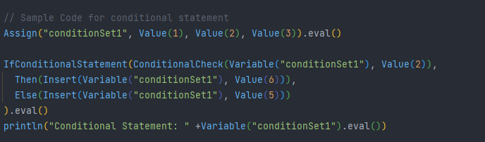
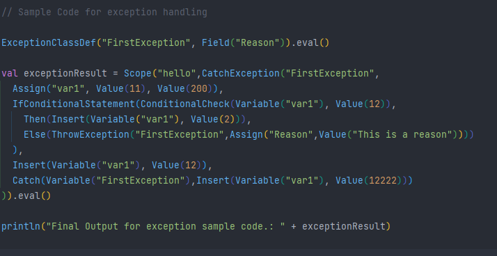

# CS - 474 | Homework 4 | Due: 04/11/2022
### Description: using a language for users of the set theory that you created in the previous homeworks add constructs for control structures and exception handling using lazy evaluation and call-by-name.

## Name: Samihan Nandedkar
### UIN: 667142409
### Email: snande3@uic.edu

<hr/>

### Running the Project
The project and be compiled and run two ways.
* Through Command Line
    * Clone the following repository in your system.
    * On command line please navigate to the following repository. And run the following commands to compile and run the code.
  ```
  sbt clean compile test
    ``` 
    ```
    sbt clean compile run
    ```
* Through IntelliJ IDEA
    * Clone the following repository in your system.
    * Import the project into IntelliJ.
    * Compile and run the simulation from there. 

### Project Description

The main aim of the project is to create a Domain Specific Language using Scala to perform the various set operations.
The user will be able to create Conditional Statements by specifying the condition, then and else clause. 
In addition the user will be able to create ExceptionClass, throw Exception and run a different block of code whenever
exception is caught.

### Project Structure
* All the language descriptions are present in `SetLangDSL` file present in com.samihan.hw1 package.
* The test cases for the project are present in /src/test/scala/SetLangDSLTest.scala files. 
* Practice.scala can be used to implement and test the language syntax.

### How to use SetLangDSL Language.
* Please import the following package to use the language.
```
import com.samihann.hw1.SetLangDSL.SetDeclarations.*
```
* A sample [file](/src/main/scala/Practice.scala) is created to practice and test the language's syntax.
* In addition, sample code is provided in the `Practice` module for all the functionalities of the language.
* All the operations need to be executed with operation.eval to perform the computation and receive output.
* Detailed explation of the language syntax and semantics is provided below. 

<hr/>

### Implementation: Logic and Implementation

1. IfConditionalStatement:

* If statements accepts three parameter: condition, thenClause, elseClause
* Condition expression will be evaluated.
* If it returns true then thenClause is executed 
* If it returns false then elseClause is executed

2. Then:

* Then statement contains a list of operations which will be executed one by one.
* If the conditional statement is used inside a CatchExpression, then it will check if ThrowExpression is passed as operation then it will set the `isExceptionCaught` flag as true.

3. Else:

* Then statement contains a list of operations which will be executed one by one.
* If the conditional statement is used inside a CatchExpression, then it will check if ThrowExpression is passed as operation then it will set the `isExceptionCaught` flag as true.


4. CatchException:

* This statement is equivalent to Java's Try statement. 
* It will accept the name of exception class that it wants to catch as first parameter. 
* Then it will accept multiple operations of type as SetDeclaration which are evaluated one by one.
* Before each evaluation it checks if a exception is caught which is kept track using `isExceptionCaught` atomic boolean. 
* If the `isExceptionCaught` set true, then it will not evaluate any further statement until Catch statement is evaluated.
* It will finally return Success or Exception Caught message. 

5. ExceptionClassDef:

* ExceptionClassDef accepts name of the class as first parameter and Field operation signifying the fields to be created in the map. 
* It creates a tempMap with pointing all the field values null. 
* It will then update the global exceptionBindingScope with name as the key and tempMap as value. 

6. ThrowException:

* ThrowException accepts the name of exception class first parameter and a second parameter will be Assign statement setting the value of exception class' field with value to be returned. 
* It updates the value of field with the value specified in Assign.

7. Catch:

* Catch statement will accept the exception variable as first parameter, then it can accept variable number of parameter as input. 
* There operation will be evaluated one by one once completed it will return a custom message. 

### SetLandDSL: IfConditionalStatement, ExceptionClassDef, ThrowException, CatchException & Catch

Quick glance of list of commands to create abstract class & methods, interface and to inherit from Abstract Class and Interface Declaration.

<table>
<thead>
<tr>
<td>
<b>Syntax</b>
</td>
<td>
<b>Parameters</b>
</td>
<td>
<b>Usage</b>
</td>
</tr>
</thead>
<tbody>


<tr>
<td>
IfConditionalStatement(condition: SetDeclarations, thenClause: SetDeclarations, elseClause: SetDeclarations)
</td>
<td>
1. condition <br/>
Type: SetDeclarations.ConditionalCheck <br/>
2. thenClause <br/>
Type: SetDeclarations.Then <br/>
3. elseClause <br/>
Type: SetDeclaration.Else
</td>
<td>
 IfConditionalStatement(ConditionalCheck(Variable("var1"), Value(11)), <br/>
        Then(Insert(Variable("var1"), Value(2))), <br/>
        Else(Insert(Variable("var1"), Value(3)))
        ).eval()
</td>
</tr>

<tr>
<td>
Then(operations: SetDeclarations*)
</td>
<td>
1. operations <br/>
Type: SetDeclarations <br/>
Multiple parameters accepted for operations
</td>
<td>
Then(Insert(Variable("var1"), Value(2)))
<br/>
Note: SHould be defined in IfConditionaStatement
</td>
</tr>

<tr>
<td>
Else (operations: SetDeclarations*)
</td>
<td>
1. operations <br/>
Type: SetDeclations <br/>
Multiple Parameters accepted for operations
</td>
<td>
Else(Insert(Variable("var1"), Value(3)))
<br/>
Note: SHould be defined in IfConditionaStatement
</td>
</tr>

<tr>
<td>
ExceptionClassDef(name: String, operations: SetDeclarations)
</td>
<td>
1. name <br/>
Type: String <br/>
2. operations <br/>
Type: SetDeclaration.Field <br/>
</td>
<td>
ExceptionClassDef("FirstException", Field("Reason")).eval()
</td>
</tr>

<tr>
<td>
ThrowException(name: String, operation: SetDeclarations.Assign)
</td>
<td>
1. name <br/>
Type: String <br/>
2. operation <br/>
Type: SetDeclarations.Assign <br/>
</td>
<td>
ThrowException("FirstException",Assign("Reason",Value("This is a reason")))
</td>
</tr>

<tr>
<td>
CatchException(name: String, operations: SetDeclarations*) <br/> <br/>

Note: This whole block of code can be passed inside a Scope to create a scope as shown in example code below. 
</td>
<td>
1. name <br/>
Type: String <br/>
2. operations <br/>
Type: SetDeclarations <br/>
Multiple Parameters accepted for operations 
</td>
<td>
CatchException("FirstException", <br/>
      Assign("var1", Value(11), Value(200)),<br/>
      IfConditionalStatement(ConditionalCheck(Variable("var1"), Value(11)),<br/>
        Then(Insert(Variable("var1"), Value(2))),<br/>
        Else(ThrowException("FirstException",Assign("Reason",Value("This is a reason"))))<br/>
        ),
      Insert(Variable("var1"), Value(12)),<br/>
      Catch(Variable("FirstException"),Insert(Variable("var1"), Value(12222)))<br/>
    ).eval()

</td>
</tr>

<tr>
<td>
Catch(exception: SetDeclarations, operations: SetDeclarations*)
</td>
<td>
1. exception <br/>
Type: SetDeclarations <br/>
2. operations <br/>
Type: SetDeclarations <br/>
Multiple Parameters accepted for operations
</td>
<td>
Catch(Variable("FirstException"),Insert(Variable("var1"), Value(12222))
</td>
</tr>


<tr>
<td>
ConditionalCheck(setName: SetDeclarations, toCheckValue: SetDeclarations)
</td>
<td>
1. setName <br/>
Type: SetDeclarations <br/>
2. toCheckValue <br/>
Type: SetDeclarations.Value <br/>
</td>
<td>
ConditionalCheck(Variable("var1"), Value(11)
</td>
</tr>


</tbody>
</table>

### Sample Code. (Code can be found in this /src/main/scala/Practice.scala)

* Conditional Statement



* Exception Handling




<hr/>

### Syntax : Detailed Syntax. (Code can be found in this /src/main/scala/Practice.scala)

1. IfConditionalStatement

```
IfConditionalStatement(ConditionalCheck(Variable("conditionSet1"), Value(2)),
      Then(Insert(Variable("conditionSet1"), Value(6))),
      Else(Insert(Variable("conditionSet1"), Value(5)))
    ).eval()
```

2. Then

```
Then(Insert(Variable("conditionSet1"), Value(6)))
```

3. Else

```
Else(Insert(Variable("conditionSet1"), Value(5)))
```

4. ExceptionClassDef

```
ExceptionClassDef("FirstException", Field("Reason")).eval()
```

5. ThrowException

```
ThrowException("FirstException",Assign("Reason",Value("This is a reason")))
```

6. Catch

```
 Catch(Variable("FirstException"),Insert(Variable("var1"), Value(12222)))
```

7. CatchExpression

```
CatchException("FirstException",
      Assign("var1", Value(11), Value(200)),
      IfConditionalStatement(ConditionalCheck(Variable("var1"), Value(12)),
        Then(Insert(Variable("var1"), Value(2))),
        Else(ThrowException("FirstException",Assign("Reason",Value("This is a reason"))))
      ),
      Insert(Variable("var1"), Value(12)),
      Catch(Variable("FirstException"),Insert(Variable("var1"), Value(12222)))
    ).eval()
```

8. CatchExpression (Inside a Scope)

```
Scope("hello",CatchException("FirstException",
      Assign("var1", Value(11), Value(200)),
      IfConditionalStatement(ConditionalCheck(Variable("var1"), Value(12)),
        Then(Insert(Variable("var1"), Value(2))),
        Else(ThrowException("FirstException",Assign("Reason",Value("This is a reason"))))
      ),
      Insert(Variable("var1"), Value(12)),
      Catch(Variable("FirstException"),Insert(Variable("var1"), Value(12222)))
    )).eval()
```


<hr/>

### SetLandDSL: AbstractClass, Interface, Abstract Methods & Inheritance syntax

Quick glance of list of commands to create abstract class & methods, interface and to inherit from Abstract Class and Interface Declaration.

<table>
<thead>
<tr>
<td>
<b>Syntax</b>
</td>
<td>
<b>Parameters</b>
</td>
<td>
<b>Usage</b>
</td>
</tr>
</thead>
<tbody>


<tr>
<td>
AbstractClass(name, operations*)
</td>
<td>
1. name <br/>
Type: String <br/>
2. operations <br/>
Multiple Parameters
Type: SetDeclarations (Fields, Constructor, Methods & AbstractMethods) <br/>

Note: Each AbstractClass definition will declaration of atleast one Abstract Method or a error will be returned.
</td>
<td>
AbstractClassDef("Hello", Private(Field("helloAgain")), Constructor(Assign("helloAgain", Value(2))), Protected(AbstractMethod("m2", ListBuffer("a", "b"))) ,Public(Method("m2", ListBuffer("a", "b"), Union(Variable("a"), Variable("b"))))).eval()<br/>
</td>
</tr>

<tr>
<td>
AbstractMethod(methodName, parameters, operations*)
</td>
<td>
1. methodName <br/>
Type: String <br/>
2. parameters <br/>
Type: List[String] <br/>

Note: Abstract method will not have any operations.
</td>
<td>
Should be given while Abstract class/ Interface creation.<br/>
Should always be inside an access definition. <br/>
AbstractMethod("m1", ListBuffer("a","b"))<br/>
Public(AbstractMethod("m1", ListBuffer("a","b"))<br/>
</td>
</tr>

<tr>
<td>
Interface(name, operations*)
</td>
<td>
1. name <br/>
Type: String <br/>
2. operations <br/>
Multiple Parameters
Type: SetDeclarations (Fields, Constructor & AbstractMethods) <br/>

Note: Interface definition will require all methods to be of type AbstractMethod.

</td>
<td>
Interface("Hello", Private(Field("helloAgain")), Constructor(Assign("helloAgain", Value(2))), Protected(AbstractMethod("m2", ListBuffer("a", "b"))) ,Public(Method("m2", ListBuffer("a", "b")).eval()<br/>
</td>
</tr>

<tr>
<td>
Inheritance (Interface)
</td>
<td>
1. parentInterface <br/>
Type: String <br/>
2. classDef <br/>
Type: SetDeclaration.ClassDef <br/>
</td>
<td>
ClassDef("childClass",...) Implements "parentInterface"<br/>

Note: Interface inheritance requires ClassDef to override all the abstract methods declared in Interface. Else it will give error. 
</td>
</tr>

<tr>
<td>
Inheritance (AbstractClass)
</td>
<td>
1. parentClass <br/>
Type: String <br/>
2. classDef <br/>
Type: SetDeclaration.ClassDef <br/>
</td>
<td>
ClassDef("childClass",...) Implements "parentClass"<br/>

Note: AbstractClass inheritance requires ClassDef to override all the abstract methods declared in Interface. Else it will give error.
</td>
</tr>


</tbody>
</table>


### SetLangDSL: Class, Object, Inheritance Syntax

Quick glance of list of commands to create class, object, fields, methods & inheritance. 

<table>
<thead>
<tr>
<td>
<b>Syntax</b>
</td>
<td>
<b>Parameters</b>
</td>
<td>
<b>Usage</b>
</td>
</tr>
</thead>
<tbody>
<tr>
<td>
Field(name)
</td>
<td>
1. name <br/>
Type: String
</td>
<td>
Should be given while class creation using ClassDef. <br/>
Should always be inside a access definition. <br/>
Field("sampleName")<br/>
Private(Field("sampleName"))<br/>
</td>
</tr>
<tr>
<td>
Constructor(operations*)
</td>
<td>
1. operations <br/>
Type: SetDeclarations <br/>
Multiple Parameters can be passed
</td>
<td>
Should be given while class creation. <br/>
Constructor(Assign("a1", Value(2))
</td>
</tr>

<tr>
<td>
Methods(methodName, parameters, operations*)
</td>
<td>
1. methodName <br/>
Type: String <br/>
1. parameters <br/>
Type: List[String] <br/>
1. operations <br/>
Type: SetDeclarations <br/>
Multiple Parameters can be passed <br/>
</td>
<td>
Should be given while class creation.<br/>
Should always be inside a access definition. <br/>
Method("m1", ListBuffer("a","b"), Union(Variable("a"), Variable("b"))<br/>
Public(Method("m1", ListBuffer("a","b"), Union(Variable("a"), Variable("b")))<br/>
</td>
</tr>

<tr>
<td>
ClassDef(name, operations*)
</td>
<td>
1. name <br/>
Type: String <br/>
2. operations <br/>
Multiple Parameters
Type: SetDeclarations (Fields, Constructor & Methods) <br/>
</td>
<td>
ClassDef("Hello", Private(Field("helloAgain")), Constructor(Assign("helloAgain", Value(2))), Public(Method("m2", ListBuffer("a", "b"), Union(Variable("a"), Variable("b"))))).eval()<br/>
</td>
</tr>


<tr>
<td>
Private(operation)
</td>
<td>
1. operation <br/>
Type: SetDeclarations.Fields/Methods <br/>

</td>
<td>
Should be given in Class Definition<br/>
Private(Field("a").eval()<br/>
</td>
</tr>


<tr>
<td>
Public(operation)
</td>
<td>
1. operation <br/>
Type: SetDeclarations.Fields/Methods <br/>

</td>
<td>
Should be given in Class Definition<br/>
Public(Field("a").eval()<br/>
</td>
</tr>

<tr>
<td>
Protected(operation)
</td>
<td>
1. operation <br/>
Type: SetDeclarations.Fields/Methods <br/>

</td>
<td>
Should be given in Class Definition<br/>
Protected(Field("a").eval()<br/>
</td>
</tr>

<tr>
<td>
RetrieveField(objName, fieldName)
</td>
<td>
1. objName <br/>
Type: String <br/>
2. fieldName <br/>
Type: String <br/>
</td>
<td>
RetrieveField("obj1","a").eval()<br/>
</td>
</tr>

<tr>
<td>
NewObject(name, className)
</td>
<td>
1. name <br/>
Type: String <br/>
2. className <br/>
Type: String <br/>
</td>
<td>
NewObject("firstObj", "Class1").eval()<br/>
</td>
</tr>

<tr>
<td>
InvokeMethod(objName, methodName, parameters*)
</td>
<td>
1. objName <br/>
Type: String <br/>
2. methodName <br/>
Type: String <br/>
3. parameters <br/>
Type: SetDeclaration.Assign <br/>
</td>
<td>
InvokeMethod("object1", "m2", Assign("a", Value(2), Value(3)), Assign("b", Value(4), Value(5))).eval()<br/>
</td>
</tr>


<tr>
<td>
Inheritance
</td>
<td>
1. parentClass <br/>
Type: String <br/>
2. classDef <br/>
Type: SetDeclaration.ClassDef <br/>
</td>
<td>
ClassDef("childClass",...) Extends "ParentCLass"<br/>
</td>
</tr>


</tbody>

</table>


### SetLangDSL: Basic Command Syntax 

Quick glance of list of basic command to perform computation functionalities provided by the language. 

<table>
<thead>
<tr>
<td>
<b>Syntax</b>
</td>
<td>
<b>Parameters</b>
</td>
<td>
<b>Usage</b>
</td>
</tr>
</thead>
<tbody>
<tr>
<td>
Value(someValue)
</td>
<td>
1. someValue <br/>
Type: Any
</td>
<td>
Value(5).eval() -> 5 <br/>
Value("Hello").eval() -> "Hello"
</td>
</tr>
<tr>
<td>
Assign(name, values*)
</td>
<td>
1. name <br/>
Type: String<br/>
2. values <br/>
Type: SetDeclarations <br/>
Multiple Values Parameters,
Can be used to create String.
</td>
<td>
Assign("var1", Value(2)).eval()<br/>
Create a binding of (var1 -> 2), Returns 2. <br/>

Assign("varSet1", Value(2), Value(3)).eval() <br/>
Creates a set of values. (varSet1 -> (2,3) <br/>

Assign("varSet2", Value(10), Value(20)).eval() <br/>
Creates a set of values. (varSet1 -> (2,3)
</td>
</tr>

<tr>
<td>
Variable(varName)
</td>
<td>
1. varName <br/>
Type: String
</td>
<td>
Variable("var1").eval() -> 2<br/>
Variable("varSet1").eval() -> (2,3) <br/>
</td>
</tr>


<tr>
<td>
Insert(var, value)
</td>
<td>
1. var <br/>
Type: SetDeclarations <br/>
2. value <br/>
Type: SetDeclarations <br/>
</td>
<td>
Insert("varSet1", Value(5).eval() -> (2,3,5)<br/>
</td>
</tr>

<tr>
<td>
Delete(var, value)
</td>
<td>
1. var <br/>
Type: SetDeclarations <br/>
2. value <br/>
Type: SetDeclarations <br/>
</td>
<td>
Insert("varSet1", Value(2)).eval() -> (3,5)<br/>
</td>
</tr>

<tr>
<td>
Union(setVariable1, setVariable2)
</td>
<td>
1. setVariable1 <br/>
Type: SetDeclarations.Variable <br/>
2. setVariable2 <br/>
Type: SetDeclarations.Variable <br/>
</td>
<td>
Union(Variable("varSet1")", Variable("varSet2")).eval() -> (2,3,10,20)<br/>
</td>
</tr>


<tr>
<td>
Difference(setVariable1, setVariable2)
</td>
<td>
1. setVariable1 <br/>
Type: SetDeclarations.Variable <br/>
2. setVariable2 <br/>
Type: SetDeclarations.Variable <br/>
</td>
<td>
Difference(Variable("varSet1")", Variable("varSet2")).eval() -> (2,3)<br/>
</td>
</tr>

<tr>
<td>
SymmetricDifference(setVariable1, setVariable2)
</td>
<td>
1. setVariable1 <br/>
Type: SetDeclarations.Variable <br/>
2. setVariable2 <br/>
Type: SetDeclarations.Variable <br/>
</td>
<td>
SymmetricDifference(Variable("varSet1")", Variable("varSet2")).eval() -> (2,3)<br/>
</td>
</tr>

<tr>
<td>
Intersection(setVariable1, setVariable2)
</td>
<td>
1. setVariable1 <br/>
Type: SetDeclarations.Variable <br/>
2. setVariable2 <br/>
Type: SetDeclarations.Variable <br/>
</td>
<td>
Intersection(Variable("varSet1")", Variable("varSet2")).eval() -> (2)<br/>
</td>
</tr>

<tr>
<td>
CartesianProduct(setVariable1, setVariable2)
</td>
<td>
1. setVariable1 <br/>
Type: SetDeclarations.Variable <br/>
2. setVariable2 <br/>
Type: SetDeclarations.Variable <br/>
</td>
<td>
CartesianProduct(Variable("varSet1")", Variable("varSet2")).eval() -> ((3,10), (2,10))<br/>
</td>
</tr>

<tr>
<td>
Macro(nameMacro, operation)
</td>
<td>
1. nameMacro <br/>
Type: String <br/>
2. operation <br/>
Type: SetDeclarations <br/>
</td>
<td>
Macro("nameMacro", Intersection(Variable("varSet1")", Variable("varSet2"))).eval()<br/>
</td>
</tr>


<tr>
<td>
ImpMacro(macroVariable)
</td>
<td>
1. macroVariable <br/>
Type: SetDeclarations.Macro <br/>
</td>
<td>
ImpMacro(Variable("nameMacro)).eval() -> (2)<br/>
</td>
</tr>


<tr>
<td>
Check(setVariable, valueTobeChecked)
</td>
<td>
1. setVariable <br/>
Type: SetDeclarations.Variable <br/>
2. valueTobeChecked <br/>
Type: SetDeclarations.Value <br/>
</td>
<td>
Check(Variable("setName1), Value(2)).eval() -> true<br/>
</td>
</tr>


<tr>
<td>
Scope(scopeName, operations ..*)
</td>
<td>
1. scopeName <br/>
Type: String<br/>
2. operation <br/>
Type: SetDeclarations <br/>
Multiple Values Parameters,
Returns the output of last parameter.
</td>
<td>
Scope("scope1", Assign("varSet1", Value(2), Value(3)), Insert("varSet1", Value(5)) ).eval() -> (2,3,5)<br/>
</td>
</tr>


<tr>
<td>
GetScopeVariable(scopeName, varName)
</td>
<td>
1. scopeName <br/>
Type: String<br/>
2. varName <br/>
Type: String <br/>
</td>
<td>
GetScopeVariable("scope1", "varSet1" ).eval() -> (2,3,5)<br/>
</td>
</tr>

</tbody>

</table>


### Test Cases

* Test Cases are present in `/src/test/scala/SetLangDSLTest.scala`


* Through Command Line
  * Clone the following repository in your system.
  * On command line please navigate to the following repository. And run the following commands to compile and run the test cases.

  ```
  sbt clean compile test
  ```
